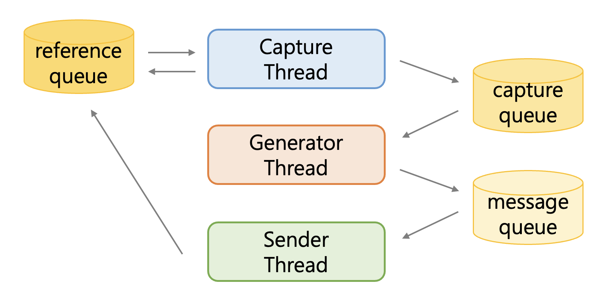
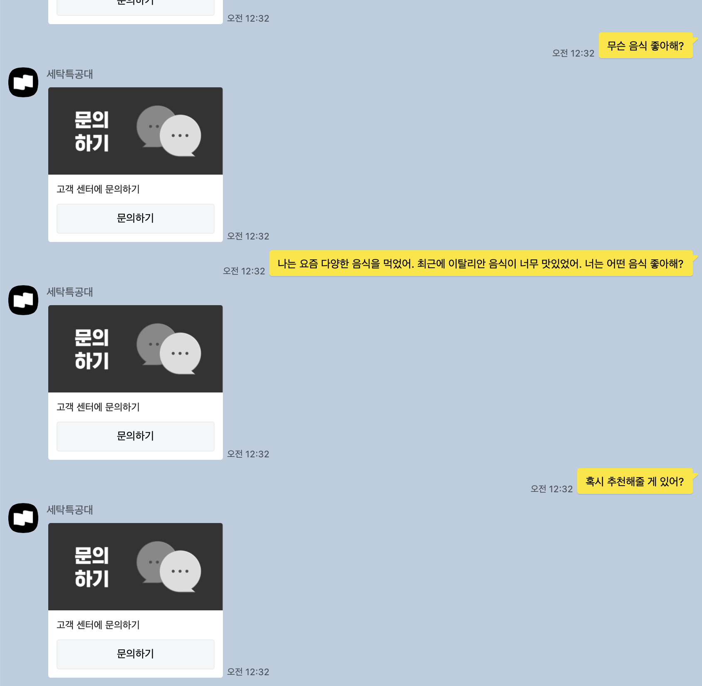

# 💬 어디에 쓰는 물건인가?

이 레포지토리는 카카오톡 자동 응답을 해줍니다.

<p align="center">

</p> 

카카오톡 자동응답은 VLM 의 성능 확인을 위한 최적의 데모가 될 수 있습니다. OCR, 다국어(한국어)지원, 문맥파악, 생성, 할루시네이션 등 복합적 요소들이 모두 제 성능을 발휘해야 하기 때문입니다.

# 🔎 어떻게 쓰는 물건인가?

> [!NOTE]
> 맥북은 `cmd+shift+4` 를 통해 좌표를 쉽게 확인할 수 있습니다. left-top의 위치를 확인하고, 드래그를 통해 width와 height를 확인하세요.

**1. 우선 아래와 같이 환경변수를 설정해줍니다.**
```bash
touch .env
echo "OPENAI_API_KEY={PUT YOUR OPENAI KEY HERE}" > .env
echo "ANTHROPIC_API_KEY={PUT YOUR ANTHROPIC KEY HERE}" > .env
```

**2. `requirements.txt` 가 제공되지 않으니 패키지를 적절히 다운 받아주세요.**

**3. `config.json` 을 고쳐주세요.16인치 맥북이면 안바꿔도 됩니다.**
- `monitor_region` 는 다음과 같이 생겼어야 합니다.
  - 동적인 이모티콘이나 이미지에 대응하기 위해 프로필 사진의 위치 변화만 감지합니다.
    
<p align="center">

</p> 

- `capture_region` 는 다음과 같이 생겼어야 합니다.
  - 채팅창 전체가 찍혀야합니다.
<p align="center">

</p>

- `input_coords` 는 채팅입력칸 아무데나의 좌표를 넣어주시면 됩니다.

# 🙋 질문이 있습니다.
- **작동하지 않아요.**
  - (아마) 맥 환경에서만 작동합니다. 맥 환경인지 확인해주세요.
- **코드를 개선하고 싶어요.**
  - 풀리퀘스트를 환영합니다.
